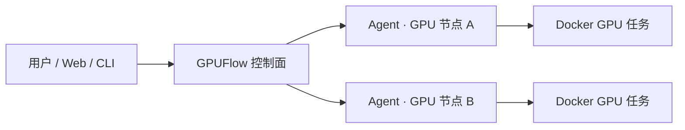

# GPUFlow

轻量级 BYOC（Bring Your Own Compute）GPU 批任务调度器。

GPUFlow 把分散在本地工作站、实验室服务器和自建机房中的 GPU 节点接入同一个控制面，统一完成任务提交、资源匹配、执行监控、失败重试与日志查看。算力仍由使用者自己提供，GPUFlow 不转售算力，也不介入云厂商计费。

> 当前状态：社区预览版。现阶段重点支持可信网络中的本地 Docker 节点；任务和节点使用 JSON 文件保存，任务镜像记录可选用 MySQL，任务产物可选用 S3 兼容对象存储，适合个人、实验室和小型团队验证批任务调度流程。

## 为什么使用 GPUFlow

- **统一入口**：不必分别登录每台 GPU 主机，任务统一从 Web 控制台或 CLI 提交。
- **按资源调度**：根据 GPU 数量、显存、资源池和参考单价选择可用节点。
- **任务级可靠性**：支持超时、失败重试、状态跟踪和运行日志。
- **BYOC 模式**：节点和云账号归用户所有，费用直接由用户承担。
- **轻量部署**：控制面、Agent 和 CLI 由同一个 Go 程序提供。



## 已有能力

- 节点注册、心跳、在线状态和安全删除
- 运行任务中的节点禁止删除
- `lowest_cost`、`most_vram` 调度策略
- GPU 数量、最低显存和资源池约束
- Docker 容器执行、超时控制和失败重试
- 任务状态、输出与日志查看
- 任务停止、重跑、删除、搜索、过滤与分页
- 任务产物自动归档与下载
- Bearer Token API 鉴权
- 任务和节点使用 JSON 文件持久化；任务镜像记录可选 MySQL
- 响应式 Web 控制台
- 从 Python 或 Shell 脚本构建任务镜像
- Windows、Linux 和 Docker Agent 接入指引

## 三分钟体验

### 环境要求

- Docker
- Docker Compose

### 启动控制面和演示节点

在项目根目录执行：

```bash
docker compose --profile demo up --build -d
```

打开 [http://localhost:8080](http://localhost:8080)，本地演示 Token 为：

```text
development-token
```

演示节点不声明 GPU，可用来体验节点管理、CPU 任务提交和调度流程。请勿把演示 Token 用于公网或生产环境。

停止服务：

```bash
docker compose --profile demo down
```

## 一体化部署（GPUFlow + MySQL + MinIO）

一体化部署会启动 GPUFlow 控制端、MySQL 和 MinIO。数据库与对象存储不会打进 GPUFlow 镜像，各自使用独立 Docker Volume：

```bash
cp .env.example .env
docker compose -f compose.yaml -f compose.full.yaml up --build -d
```

Windows PowerShell 可使用：

```powershell
Copy-Item .env.example .env
docker compose -f compose.yaml -f compose.full.yaml up --build -d
```

首次部署前，请修改 `.env` 中的 Token、MySQL 密码和 MinIO 密码。控制端会幂等创建 `task_images` 表与 `gpuflow-artifacts` 存储桶，不会清空已有数据。MinIO 控制台位于 [http://127.0.0.1:9001](http://127.0.0.1:9001)。

查看状态和日志：

```bash
docker compose -f compose.yaml -f compose.full.yaml ps
docker compose -f compose.yaml -f compose.full.yaml logs -f control-plane mysql minio
```

停止服务但保留数据：

```bash
docker compose -f compose.yaml -f compose.full.yaml down
```

不要随意添加 `-v`，否则会删除 MySQL 和 MinIO 数据卷。

任务脚本只需把需要保留的文件写入 `$GPUFLOW_ARTIFACT_DIR`。Agent 会在任务结束后生成 `artifacts.tar.gz` 并上传；在任务队列点击任务即可通过“下载产物”按钮获取。

已有 MySQL 时无需使用 `compose.mysql.yaml`，只需为控制端设置：

```env
GPUFLOW_MYSQL_DSN=gpuflow:密码@tcp(mysql-host:3306)/gpuflow?parseTime=true&charset=utf8mb4
```

已有 S3/MinIO 时也可直接配置 `GPUFLOW_S3_ENDPOINT`、`GPUFLOW_S3_ACCESS_KEY`、`GPUFLOW_S3_SECRET_KEY`、`GPUFLOW_S3_BUCKET` 和 `GPUFLOW_S3_USE_SSL`。

## 接入真实 GPU 节点

目标主机需要具备：

- Docker
- NVIDIA GPU 驱动
- NVIDIA Container Toolkit（运行 GPU 容器时需要）
- 能够访问 GPUFlow 控制面的网络

启动控制面后，在 Web 控制台进入 **节点 → 接入算力节点**。选择目标系统并填写节点信息，页面会生成可直接复制的 Agent 命令。

接入时请注意：

- **控制端地址**必须是目标主机能够访问的地址。
- 本机测试可以使用 `http://127.0.0.1:8080`。
- 远程节点应改为控制面所在机器的局域网 IP、域名或 HTTPS 地址。
- **节点标识**必须唯一，并在节点重启后保持不变，例如 `lab-rtx4090-01`。
- **调度参考单价**的单位为人民币元/GPU/小时，仅用于节点排序；本机测试可填写 `0`。

控制面可通过 `GPUFLOW_PUBLIC_URL` 设置页面默认生成的远程访问地址：

```env
GPUFLOW_PUBLIC_URL=http://127.0.0.1:8080
```

默认值适合本机体验。部署到其他机器后，请由部署者改成节点实际可访问的地址。

### Docker Agent 的运行方式

Agent 需要访问宿主机 Docker，因此容器启动时通常要挂载 Docker Socket：

```bash
docker run -d \
  --name gpuflow-agent \
  --restart unless-stopped \
  -v /var/run/docker.sock:/var/run/docker.sock \
  -v /var/lib/gpuflow/artifacts:/var/lib/gpuflow/artifacts \
  -e GPUFLOW_ARTIFACT_WORKDIR=/var/lib/gpuflow/artifacts \
  gpuflow:latest agent \
  -server "http://control-plane.example.com:8080" \
  -token "replace-with-your-token" \
  -id "lab-gpu-01" \
  -name "lab-gpu-01" \
  -provider local \
  -pool default \
  -gpu-model "RTX-4090" \
  -gpu-count 1 \
  -vram 24 \
  -hourly-price 0 \
  -executor docker
```

`gpuflow:latest` 表示目标主机本地已有的 GPUFlow 镜像。产物工作目录必须以相同绝对路径挂载到 Agent 容器；Agent 直接作为宿主机进程运行时不需要设置该目录。实际接入时，建议优先复制控制台根据当前配置生成的完整命令。

## 提交任务

最简单的方式是在 Web 控制台的 **任务** 页面创建任务。仓库也提供了一个 CPU 示例：[examples/job.json](examples/job.json)。

从源码构建 CLI 后，可以这样提交：

```bash
go build -o bin/gpuflow ./cmd/gpuflow
./bin/gpuflow submit \
  -server http://localhost:8080 \
  -token development-token \
  -file examples/job.json
```

常用命令：

```text
gpuflow server [-addr :8080] [-data ./data/state.json] [-mysql-dsn DSN]
gpuflow agent  [-server URL] [-pool default] [-executor docker|mock]
gpuflow submit -file examples/job.json
gpuflow jobs
gpuflow nodes
gpuflow get JOB_ID
```

CLI 命令也支持通过环境变量设置控制面地址和 Token：

```env
GPUFLOW_SERVER=http://localhost:8080
GPUFLOW_TOKEN=replace-with-a-long-random-token
```

任务队列支持按名称、ID、镜像或节点搜索，并可按状态、节点和资源池过滤。点击“重跑”会复制原任务配置并生成新的任务 ID；停止运行任务时，Agent 会执行 `docker stop` 并将状态更新为“已取消”。为避免丢失执行现场，只有已完成、失败或取消的任务可以删除，删除时会同时清理对象存储中的任务产物。

## 从脚本构建任务镜像

Web 控制台的 **镜像** 页面可以上传一个 `.py` 或 `.sh` 文件，并选择 Shell、Python 3.12、CUDA 12 或 PyTorch CUDA 基础环境。构建完成后，可以直接在任务表单中选择生成的镜像。

### 快速验证日志与产物下载

仓库中的 [examples/quick-smoke.sh](examples/quick-smoke.sh) 不需要额外依赖，可用于跑通完整流程：

1. 在 **任务镜像 → 上传任务脚本** 中选择该文件。
2. 运行环境选择 **Shell**，镜像名称填写 `gpuflow-task/quick-smoke:v1`，依赖留空。
3. 构建成功后点击 **使用此镜像提交任务**。演示 CPU 节点将 GPU 数量设为 `0`；真实 GPU 节点可设为 `1`。
4. 任务完成后在 **任务队列** 点击任务，可查看执行信息与日志，并下载包含 `result.txt` 的 `artifacts.tar.gz`。

GPU 检测示例 [examples/gpu-smoke.py](examples/gpu-smoke.py) 应选择 **PyTorch CUDA** 环境；PyTorch 已包含在基础镜像中，测试时依赖同样留空。

当前限制：

- 单个脚本最大 5 MB。
- 控制面所在主机必须能够访问 Docker。
- 构建过程会异步执行，并在页面中展示日志。
- 本地构建的镜像只存在于控制面主机。多节点部署时，应将镜像推送到所有 Agent 可访问的共享镜像仓库。
- 只应构建和运行可信代码。

## 配置

### 控制面

| 环境变量 | 默认值 | 说明 |
| --- | --- | --- |
| `GPUFLOW_ADDR` | `:8080` | HTTP 监听地址 |
| `GPUFLOW_DATA` | `./data/state.json` | 状态文件路径 |
| `GPUFLOW_TOKEN` | 空 | API Bearer Token；对外部署时必须设置 |
| `GPUFLOW_PUBLIC_URL` | 当前页面来源 | Agent 命令使用的控制面公开地址 |
| `GPUFLOW_AGENT_IMAGE` | `gpuflow:latest` | 接入页面生成 Docker Agent 命令时使用的镜像名 |
| `GPUFLOW_MYSQL_DSN` | 空 | 可选，仅用于持久化任务镜像记录 |
| `GPUFLOW_S3_ENDPOINT` | 空 | S3 兼容对象存储地址；为空时禁用产物上传 |
| `GPUFLOW_S3_ACCESS_KEY` | 空 | 对象存储 Access Key |
| `GPUFLOW_S3_SECRET_KEY` | 空 | 对象存储 Secret Key |
| `GPUFLOW_S3_BUCKET` | `gpuflow-artifacts` | 任务产物存储桶 |
| `GPUFLOW_S3_USE_SSL` | `false` | 是否使用 HTTPS 连接对象存储 |

可复制 [.env.example](.env.example) 后按部署环境修改。

如需同时启用 MySQL 与任务产物存储，可使用一体化配置：

```bash
docker compose -f compose.yaml -f compose.full.yaml up --build -d
```

未配置 MySQL 时，任务、节点和任务镜像记录都会写入 JSON 状态文件；配置 MySQL 后，任务镜像记录会写入 `task_images` 表。

### Agent

| 环境变量 | 说明 |
| --- | --- |
| `GPUFLOW_SERVER` | 控制面地址 |
| `GPUFLOW_TOKEN` | 与控制面一致的 Token |
| `GPUFLOW_NODE_ID` | 稳定且唯一的节点标识 |
| `GPUFLOW_NODE_NAME` | 节点显示名称 |
| `GPUFLOW_PROVIDER` | 提供方，当前使用 `local` |
| `GPUFLOW_POOL` | 资源池名称 |
| `GPUFLOW_GPU_MODEL` | GPU 型号 |
| `GPUFLOW_GPU_COUNT` | GPU 数量 |
| `GPUFLOW_VRAM_GB` | 单卡显存容量（GB） |
| `GPUFLOW_HOURLY_PRICE` | 调度参考单价（人民币元/GPU/小时） |
| `GPUFLOW_EXECUTOR` | `docker` 或 `mock` |
| `GPUFLOW_ARTIFACT_WORKDIR` | 可选；容器化 Agent 必须设置为宿主机与 Agent 容器共享的同路径目录 |

命令行参数会覆盖对应的环境变量。

## 发布容器镜像

仓库内置 GitHub Actions 工作流。推送 `v*.*.*` 标签后会构建 `linux/amd64`、`linux/arm64` 镜像并发布到 `ghcr.io/<owner>/<repository>`：

```bash
git tag v0.2.0
git push origin v0.2.0
```

生产环境建议使用固定版本标签，不要依赖 `latest`。首次发布后还需要在 GitHub Packages 中确认镜像包的公开访问设置。

## 从源码开发

环境要求：

- Go 1.25+
- Node.js 22+
- npm

构建 Web 前端并运行测试：

```bash
cd web
npm ci
npm run build
cd ..
go test ./...
go build -o bin/gpuflow ./cmd/gpuflow
```

启动控制面：

```bash
./bin/gpuflow server -addr :8080 -data ./data/state.json
```

## 安全与部署边界

GPUFlow Agent 通过 Docker Socket 启动任务容器，这等同于拥有宿主机上的高权限。当前版本应部署在可信网络，并仅允许可信用户和可信镜像访问。

对外部署时至少应做到：

- 设置足够长且随机的 `GPUFLOW_TOKEN`。
- 使用 HTTPS 或放在可信反向代理之后。
- 限制控制面、Agent 和 Docker API 的网络访问范围。
- 不要在公共日志、截图或仓库中提交真实 Token。
- 对任务镜像设置来源限制，并为节点配置最小网络权限。

当前 JSON 状态存储、单控制面和共享 Token 设计不适合作为不受信任用户共同使用的公网多租户平台。

## 开源版与企业版边界

开源版保留跑通任务闭环所需的基础能力，包括节点接入、调度、日志、产物上传下载、MySQL/MinIO 和单机一体化部署。企业版更适合承载规模化治理能力：多租户与 RBAC、审计、日志检索与长期归档、产物生命周期和配额、跨区域复制、密钥管理、高可用、成本报表与 SLA。

## 当前边界

- 已支持本地 Docker 节点。
- 阿里云、腾讯云等托管适配器尚未实现。
- 当前调度面向批任务，不是 Kubernetes 替代品。
- 尚未提供跨控制面高可用和多租户隔离。

## 参与贡献

欢迎提交 Issue 和 Pull Request。报告问题时，请尽量附上：

- 操作系统、Docker、Go 和 Node.js 版本
- 控制面与 Agent 的启动方式
- 可复现步骤
- 预期结果与实际结果
- 已去除 Token 等敏感信息的日志

## License

GPUFlow 使用 [MIT License](LICENSE)。
