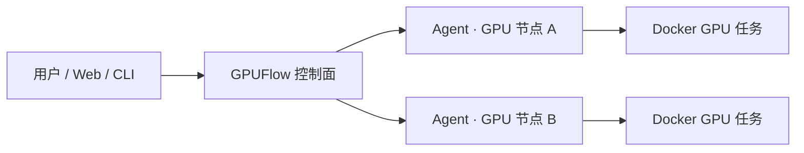

# GPUFlow

轻量级 BYOC（Bring Your Own Compute）GPU 批任务调度器。

GPUFlow 把分散在本地工作站、实验室服务器和自建机房中的 GPU 节点接入同一个控制面，统一完成任务提交、资源匹配、执行监控、失败重试与日志查看。算力仍由使用者自己提供，GPUFlow 不转售算力，也不介入云厂商计费。

> 当前状态：社区预览版。现阶段重点支持可信网络中的本地 Docker 节点；MySQL 保存任务、节点和任务镜像记录，MinIO/S3 保存任务产物，适合个人、实验室和小型团队验证批任务调度流程。

> **从一台机器跑通，到一组 GPU 高效协作：** Community 负责把批任务闭环交到你手里；当节点增多、团队开始共用算力时，[GPUFlow Enterprise](#从开源验证到企业落地) 可进一步提供 GPU 粒度并发调度、内置镜像分发、角色权限与审计能力。

## 为什么使用 GPUFlow

- **统一入口**：不必分别登录每台 GPU 主机，任务统一从 Web 控制台或 CLI 提交。
- **按资源调度**：根据 GPU 数量、显存、资源池和参考单价选择可用节点。
- **任务级可靠性**：支持超时、失败重试、状态跟踪和运行日志。
- **BYOC 模式**：节点和云账号归用户所有，费用直接由用户承担。
- **轻量部署**：控制面、Agent 和 CLI 由同一个 Go 程序提供。



## 已有能力

- 节点注册、心跳、在线状态、安全删除、搜索与分页
- 运行任务中的节点禁止删除
- `lowest_cost`、`most_vram` 调度策略
- GPU 数量、最低显存和资源池约束
- Docker 容器执行、超时控制和失败重试
- 任务状态、输出与日志查看
- 任务停止、重跑、删除、搜索、过滤与分页
- 任务产物自动归档与下载
- Bearer Token API 鉴权
- 任务、节点和任务镜像记录使用 MySQL 持久化
- 响应式 Web 控制台
- 从 Python 或 Shell 脚本构建任务镜像，并支持搜索、分页和删除
- Windows、Linux 和 Docker Agent 接入指引

## 快速开始

### 环境要求

- Docker
- Docker Compose

### 1. 配置并启动服务

首次启动前复制环境变量示例，并修改其中的 Token、MySQL 密码和 MinIO 密码：

```bash
cp .env.example .env
docker compose up --build -d
```

Windows PowerShell：

```powershell
Copy-Item .env.example .env
docker compose up --build -d
```

Compose 会把当前源码构建为 `gpuflow:local`，供控制端和同一 Docker 主机上的容器 Agent 共用。默认只启动 GPUFlow 控制面、MySQL 和 MinIO，不会自动启动或注册算力节点，也不会自动提交任务。打开 [http://localhost:18080](http://localhost:18080)，使用 `.env` 中的 `GPUFLOW_TOKEN` 登录。

确认三个服务正常：

```bash
docker compose ps
```

### 2. 接入算力节点

在 Web 控制台进入 **节点 → 接入算力节点**，填写节点信息，并在目标机器执行页面生成的 Agent 命令。节点开始持续发送心跳后，页面才会显示 `ONLINE`；仅启动控制面不会产生在线节点。

只验证 CPU 流程时，节点的 GPU 数量和显存可以填写 `0`。运行 GPU 任务时，应按目标机器的实际 GPU 数量、型号和显存填写，否则任务会因为找不到匹配节点而一直排队。

### 3. 构建并提交第一个任务

在 **任务镜像 → 上传任务脚本** 中选择 [examples/quick-smoke.sh](examples/quick-smoke.sh)，运行环境选择 **Shell**，完成镜像构建后点击 **使用此镜像提交任务**。CPU 节点测试时将任务的 GPU 数量和最低显存都设为 `0`，并确保任务资源池与节点一致或留空。

任务完成后可以查看日志，并下载包含 `result.txt` 的 `artifacts.tar.gz`。更详细的节点参数和脚本构建说明见后文“接入真实 GPU 节点”和“从脚本构建任务镜像”。

停止服务但保留数据：

```bash
docker compose down
```

## 一体化部署与数据存储

一体化部署会分别启动 GPUFlow 控制端、MySQL 和 MinIO 三个容器。MySQL 保存任务、节点和任务镜像记录，MinIO 保存任务产物；两者各自使用独立 Docker Volume，重新创建 GPUFlow 容器不会丢失这些数据。

控制端会幂等创建 `jobs`、`nodes`、`task_images` 表与 `gpuflow-artifacts` 存储桶，不会清空已有数据。MinIO 控制台默认位于 [http://127.0.0.1:9001](http://127.0.0.1:9001)。查看运行日志：

```bash
docker compose logs -f control-plane mysql minio
```

不要随意添加 `-v`，否则会删除 MySQL 和 MinIO 数据卷。

任务脚本只需把需要保留的文件写入 `$GPUFLOW_ARTIFACT_DIR`。目录中存在文件时，Agent 会在任务结束后生成 `artifacts.tar.gz` 并上传；在任务队列点击任务即可通过“下载产物”按钮获取。产物打包或上传失败会写入任务输出作为 warning，不改变任务程序本身的成功或失败状态。

使用已有 MySQL 和 MinIO/S3 时，为控制端设置：

```env
GPUFLOW_MYSQL_DSN=gpuflow:密码@tcp(mysql-host:3306)/gpuflow?parseTime=true&charset=utf8mb4
GPUFLOW_S3_ENDPOINT=minio-host:9000
GPUFLOW_S3_ACCESS_KEY=gpuflow
GPUFLOW_S3_SECRET_KEY=替换为实际密码
GPUFLOW_S3_BUCKET=gpuflow-artifacts
GPUFLOW_S3_REGION=
GPUFLOW_S3_USE_SSL=false
```

使用外部服务时，应先创建 MySQL 数据库和账号，并授予建表及读写权限；S3 凭证需要具备目标存储桶的读、写、列举和删除权限，存储桶不存在时还需要创建权限。

MySQL 和 MinIO/S3 都是必需依赖。MySQL DSN、S3 endpoint 或 S3 access/secret key 缺失，或者服务连接失败时，控制面会拒绝启动。

## 接入真实 GPU 节点

目标主机需要具备：

- Docker
- NVIDIA GPU 驱动
- NVIDIA Container Toolkit（运行 GPU 容器时需要）
- 能够访问 GPUFlow 控制面的网络

启动控制面后，在 Web 控制台进入 **节点 → 接入算力节点**。选择目标系统并填写节点信息，页面会生成可直接复制的 Agent 命令。

接入时请注意：

- **控制端地址**必须是目标主机能够访问的地址。
- 本机测试可以使用 `http://127.0.0.1:18080`。
- 远程节点应改为控制面所在机器的局域网 IP、域名或 HTTPS 地址。
- **节点标识**必须唯一，并在节点重启后保持不变，例如 `lab-rtx4090-01`。
- **调度参考单价**的单位为人民币元/GPU/小时，仅用于节点排序；本机测试可填写 `0`。

控制面可通过 `GPUFLOW_PUBLIC_URL` 设置页面默认生成的远程访问地址：

```env
GPUFLOW_PUBLIC_URL=http://127.0.0.1:18080
```

默认值适合本机体验。部署到其他机器后，请由部署者改成节点实际可访问的地址。

### Docker Agent 的运行方式

Agent 需要访问宿主机 Docker，因此容器启动时通常要挂载 Docker Socket：

```bash
docker run -d \
  --name gpuflow-agent \
  --restart unless-stopped \
  -v /var/run/docker.sock:/var/run/docker.sock \
  -v /var/lib/gpuflow/artifacts:/var/lib/gpuflow/artifacts \
  -e GPUFLOW_ARTIFACT_WORKDIR=/var/lib/gpuflow/artifacts \
  ghcr.io/stevenzhou789-cyber/gpuflow:stable agent \
  -server "http://control-plane.example.com:8080" \
  -token "replace-with-your-token" \
  -id "lab-gpu-01" \
  -name "lab-gpu-01" \
  -provider local \
  -pool default \
  -gpu-model "RTX-4090" \
  -gpu-count 1 \
  -vram 24 \
  -hourly-price 0 \
  -executor docker
```

正式节点直接使用滚动更新的 `stable`；与控制端共用 Docker 的本地开发节点可以使用 Compose 自动构建的 `gpuflow:local`。产物工作目录必须以相同绝对路径挂载到 Agent 容器；Agent 直接作为宿主机进程运行时不需要设置该目录。实际接入时，建议优先复制控制台根据当前配置生成的完整命令。

Agent 应使用稳定且唯一的 `-id`。任务执行期间 Agent 会持续发送心跳。同一 ID 的 Agent 重启后，会在剩余重试预算内清理遗留容器并从头重新执行中断的任务，同时记录恢复次数；预算耗尽时任务会直接失败。因此任务脚本应尽量保持幂等。

## 提交任务

最简单的方式是在 Web 控制台的 **任务** 页面创建任务。仓库也提供了一个 CPU 示例：[examples/job.json](examples/job.json)。

从源码构建 CLI 后，可以这样提交：

```bash
go build -o bin/gpuflow ./cmd/gpuflow
./bin/gpuflow submit \
  -server http://localhost:18080 \
  -token "与 .env 中 GPUFLOW_TOKEN 相同的值" \
  -file examples/job.json
```

常用命令：

```text
gpuflow server [-addr :8080] -mysql-dsn DSN
gpuflow agent  [-server URL] [-pool default] [-executor docker|mock]
gpuflow submit -file examples/job.json
gpuflow jobs
gpuflow nodes
gpuflow get JOB_ID
```

`-mysql-dsn` 也可以通过必填环境变量 `GPUFLOW_MYSQL_DSN` 提供。启动控制面时还必须配置 `GPUFLOW_S3_ENDPOINT`、`GPUFLOW_S3_ACCESS_KEY` 和 `GPUFLOW_S3_SECRET_KEY`；完整示例见“一体化部署”和“从源码开发”。

CLI 命令也支持通过环境变量设置控制面地址和 Token：

```env
GPUFLOW_SERVER=http://localhost:18080
GPUFLOW_TOKEN=replace-with-a-long-random-token
```

任务队列支持按名称、ID、镜像或节点搜索，并可按状态、节点和资源池过滤。点击“重跑”会复制原任务配置并生成新的任务 ID；停止运行任务时，Agent 会执行 `docker stop` 并将状态更新为“已取消”。为避免丢失执行现场，只有已完成、失败或取消的任务可以删除。删除会先持久化为“删除中”，再清理对象存储产物并删除任务记录；任一步失败都可对同一任务重试删除，不会出现产物已丢失但任务恢复为普通终态的情况。

## 从脚本构建任务镜像

Web 控制台的 **镜像** 页面可以上传一个 `.py` 或 `.sh` 文件，并选择 Shell、Python 3.12、CUDA 12 或 PyTorch CUDA 基础环境。构建完成后，可以直接在任务表单中选择生成的镜像。镜像和节点列表都支持服务端搜索与分页。

删除任务镜像会同时删除控制端本地 Docker 镜像和 MySQL 中的 `task_images` 记录。构建中的镜像不能删除；仍被排队、已分配或运行中任务引用的镜像也不能删除。已完成任务只保留原镜像名称，不阻止镜像清理。

### 快速验证日志与产物下载

仓库中的 [examples/quick-smoke.sh](examples/quick-smoke.sh) 不需要额外依赖，可用于跑通完整流程：

1. 在 **任务镜像 → 上传任务脚本** 中选择该文件。
2. 运行环境选择 **Shell**，镜像名称填写 `gpuflow-task/quick-smoke:v1`，依赖留空。
3. 构建成功后点击 **使用此镜像提交任务**。CPU 节点将 GPU 数量和最低显存设为 `0`；真实 GPU 节点按实际资源填写。
4. 任务完成后在 **任务队列** 点击任务，可查看执行信息与日志，并下载包含 `result.txt` 的 `artifacts.tar.gz`。

GPU 检测示例 [examples/gpu-smoke.py](examples/gpu-smoke.py) 应选择 **PyTorch CUDA** 环境；PyTorch 已包含在基础镜像中，测试时依赖同样留空。

当前限制：

- 单个脚本最大 5 MB。
- 控制面所在主机必须能够访问 Docker。
- 构建过程会异步执行，并在页面中展示日志。
- 本地构建的镜像只存在于控制面主机。多节点部署时，应将镜像推送到所有 Agent 可访问的共享镜像仓库。
- 只应构建和运行可信代码。

## 配置

### 控制面

| 环境变量 | 默认值 | 说明 |
| --- | --- | --- |
| `GPUFLOW_ADDR` | `:8080` | HTTP 监听地址 |
| `GPUFLOW_TOKEN` | 空 | API Bearer Token；对外部署时必须设置 |
| `GPUFLOW_PUBLIC_URL` | 当前页面来源 | Agent 命令使用的控制面公开地址 |
| `GPUFLOW_AGENT_IMAGE` | `gpuflow:local` | 接入页面生成 Docker Agent 命令时使用的镜像名；远程节点使用 GHCR `stable` |
| `GPUFLOW_MYSQL_DSN` | 无 | 必填；任务、节点和任务镜像记录使用的 MySQL DSN |
| `GPUFLOW_S3_ENDPOINT` | 无 | 必填；MinIO/S3 兼容对象存储地址 |
| `GPUFLOW_S3_ACCESS_KEY` | 无 | 必填；对象存储 Access Key |
| `GPUFLOW_S3_SECRET_KEY` | 无 | 必填；对象存储 Secret Key |
| `GPUFLOW_S3_BUCKET` | `gpuflow-artifacts` | 任务产物存储桶 |
| `GPUFLOW_S3_REGION` | 空 | 可选；对象存储区域，MinIO 通常可留空 |
| `GPUFLOW_S3_USE_SSL` | `false` | 是否使用 HTTPS 连接对象存储 |

可复制 [.env.example](.env.example) 后按部署环境修改。

默认 Compose 已包含 MySQL 与 MinIO：

```bash
docker compose up --build -d
```

任务、节点和任务镜像记录分别写入 `jobs`、`nodes`、`task_images` 表，MySQL 是唯一核心状态真源。任务产物文件由 MinIO/S3 保存，不写入 MySQL。

### Agent

| 环境变量 | 说明 |
| --- | --- |
| `GPUFLOW_SERVER` | 控制面地址 |
| `GPUFLOW_TOKEN` | 与控制面一致的 Token |
| `GPUFLOW_NODE_ID` | 稳定且唯一的节点标识 |
| `GPUFLOW_NODE_NAME` | 节点显示名称 |
| `GPUFLOW_PROVIDER` | 提供方，当前使用 `local` |
| `GPUFLOW_POOL` | 资源池名称 |
| `GPUFLOW_GPU_MODEL` | GPU 型号 |
| `GPUFLOW_GPU_COUNT` | GPU 数量 |
| `GPUFLOW_VRAM_GB` | 单卡显存容量（GB） |
| `GPUFLOW_HOURLY_PRICE` | 调度参考单价（人民币元/GPU/小时） |
| `GPUFLOW_EXECUTOR` | `docker` 或 `mock` |
| `GPUFLOW_ARTIFACT_WORKDIR` | 可选；容器化 Agent 必须设置为宿主机与 Agent 容器共享的同路径目录 |

命令行参数会覆盖对应的环境变量。

## 自动构建与发布

仓库内置 GitHub Actions 工作流，不需要在开发机手工制作发布产物：

- Pull Request 会运行 Go 测试、构建 Web，并验证 Docker 镜像能够构建，但不会发布。
- 推送到 `main` 会覆盖发布 `linux/amd64`、`linux/arm64` 的 `ghcr.io/stevenzhou789-cyber/gpuflow:stable`。
- 发布完成后会保留当前多架构镜像及其平台清单，并删除 GHCR 中其余历史版本。
- 同一次工作流会移动滚动的 `stable` Git 标签，并创建或更新同名 GitHub Release。
- Release 固定提供 Linux amd64、Linux arm64、Windows amd64 程序包和 `checksums.txt`，不会累积版本标签。

推送完成后可以直接拉取：

```bash
docker pull ghcr.io/stevenzhou789-cyber/gpuflow:stable
```

工作流使用仓库自动提供的 `GITHUB_TOKEN` 写入 GHCR 和 GitHub Release，不需要额外创建个人访问令牌。`stable` 是滚动标签，每次 `main` 发布都会替换原内容，因此部署前应先在测试节点验证。首次发布后需要在 GitHub Packages 中确认镜像包的公开访问设置；如果包并非由本仓库工作流首次创建，还要在包的 **Manage Actions access** 中授予本仓库 Admin 权限，历史版本清理才会生效。

## 从源码开发

环境要求：

- Go 1.25+
- Node.js 22+
- npm

构建 Web 前端并运行测试：

```bash
cd web
npm ci
npm run build
cd ..
go test ./...
go build -o bin/gpuflow ./cmd/gpuflow
```

启动控制面：

```bash
GPUFLOW_MYSQL_DSN='gpuflow:密码@tcp(127.0.0.1:3306)/gpuflow?parseTime=true&charset=utf8mb4' \
GPUFLOW_S3_ENDPOINT='127.0.0.1:9000' \
GPUFLOW_S3_ACCESS_KEY='gpuflow' \
GPUFLOW_S3_SECRET_KEY='替换为实际密码' \
./bin/gpuflow server -addr :8080
```

## 安全与部署边界

GPUFlow Agent 通过 Docker Socket 启动任务容器，这等同于拥有宿主机上的高权限。当前版本应部署在可信网络，并仅允许可信用户和可信镜像访问。

对外部署时至少应做到：

- 设置足够长且随机的 `GPUFLOW_TOKEN`。
- 使用 HTTPS 或放在可信反向代理之后。
- 限制控制面、Agent 和 Docker API 的网络访问范围。
- 不要在公共日志、截图或仓库中提交真实 Token。
- 对任务镜像设置来源限制，并为节点配置最小网络权限。

当前单控制面和共享 Token 设计不适合作为不受信任用户共同使用的公网多租户平台。

## 从开源验证到企业落地

GPUFlow Community 不是只能观看的演示版：它完整覆盖节点接入、批任务调度、实时日志、失败重试、产物归档以及 MySQL/MinIO 持久化，适合个人、实验室和小型团队在可信网络中真正跑任务。

> **核心区别：Community 按整台节点调度，Enterprise 按单张 GPU 调度。** Community 中一个任务占用节点后，该节点不会再接收其他任务；Enterprise 可把任务分配到明确的物理 GPU 索引，并通过 `CUDA_VISIBLE_DEVICES` 隔离可见设备，因此一台多卡服务器可以安全地并发运行多个任务。

当 GPU 从“有人能用”走向“多人高效、安全地共用”，瓶颈通常不再是提交任务，而是资源利用率、镜像交付和团队治理。GPUFlow Enterprise 在同一套任务闭环之上补齐这些能力，无需迁移到另一套调度系统：

| 对比维度 | Community 社区版 | Enterprise 企业版 |
| --- | --- | --- |
| **调度粒度** | **按节点调度；一个任务运行时独占整台节点** | **按 GPU 调度；任务绑定具体物理 GPU 索引** |
| 多卡利用率 | 多卡节点同一时间只运行一个任务 | 按任务申请的 GPU 数分配，同一节点可并发运行多个任务 |
| 设备隔离 | 不区分节点内部的 GPU 索引 | 通过 `CUDA_VISIBLE_DEVICES` 向容器暴露已分配的 GPU |
| 任务镜像 | 对接外部共享 Registry，由管理员配置凭据 | 内置轻量 OCI Registry，自动完成构建、推送、凭据下发与节点拉取 |
| 任务可观测性 | 实时查看运行日志和任务产物 | 继承实时日志与产物能力，适合纳入企业交付和运维流程 |
| 访问控制 | 共享 Bearer Token，适合可信团队 | Admin、Operator、Viewer、Agent 分角色授权 |
| 审计与交付 | MIT 开源、自助部署 | JSONL 操作审计、离线 Ed25519 License、私有化交付与商业支持 |

如果你已经遇到以下任一情况，Enterprise 通常能直接带来价值：多卡节点只能同时跑一个任务；每台节点都要手工配置镜像仓库；共享 Token 无法区分人员权限；客户要求私有部署、操作留痕或交付支持。

> **先用 Community 验证任务，再让 Enterprise 接住规模化。** [提交 Enterprise 试用、私有化部署或合作需求](https://github.com/stevenzhou789-cyber/gpuflow/issues/new)，Issue 标题可注明 `[Enterprise]`，便于优先跟进。

## 当前边界

- 已支持本地 Docker 节点。
- 阿里云、腾讯云等托管适配器尚未实现。
- 当前调度面向批任务，不是 Kubernetes 替代品。
- 尚未提供跨控制面高可用和多租户隔离。

## 参与贡献

欢迎提交 Issue 和 Pull Request。报告问题时，请尽量附上：

- 操作系统、Docker、Go 和 Node.js 版本
- 控制面与 Agent 的启动方式
- 可复现步骤
- 预期结果与实际结果
- 已去除 Token 等敏感信息的日志

## License

GPUFlow 使用 [MIT License](LICENSE)。
